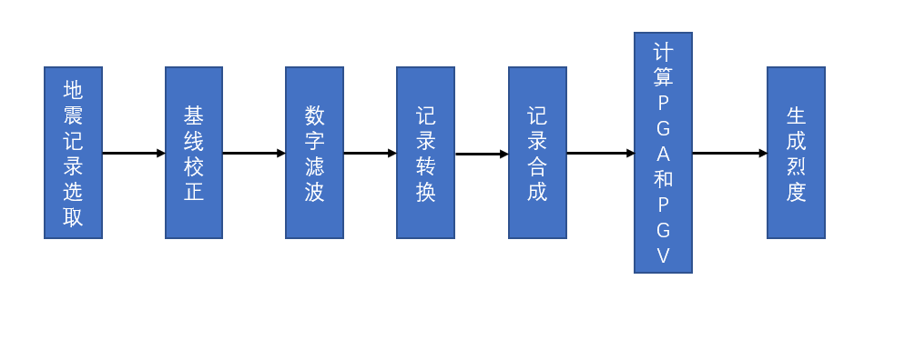
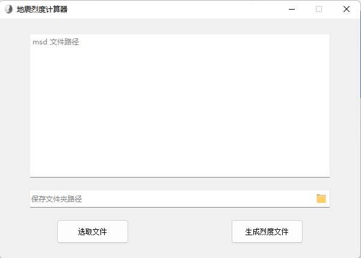
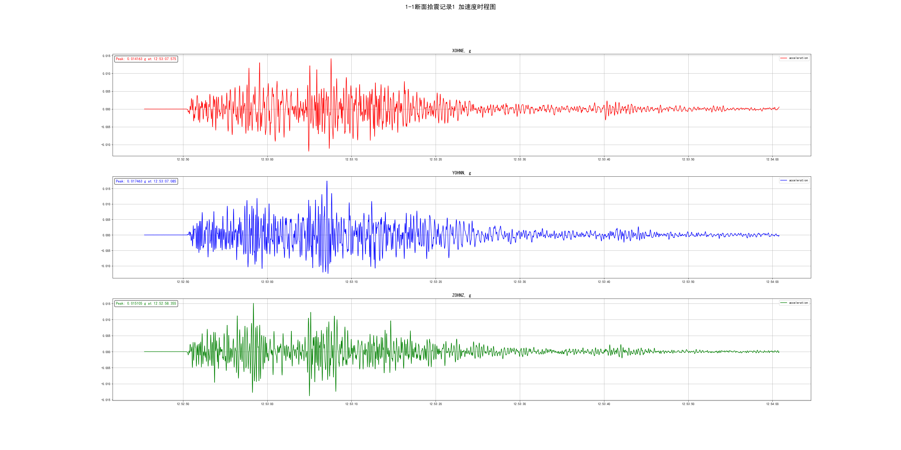

# 地震时序数据处理程序
---
基于 Obspy 框架编写的一个简单的地震烈度计算程序，将强震仪生成的 msd 数据文件导入到程序中，然后参照
《GB/T 17742-2020》给出的计算流程（如下所示），计算出最终的地震烈度。

并且为了方便程序的使用，编写了一个简单的图形界面，点击选取文件按钮，选取所要计算的 msd 文件路径和保存的文件夹
路径。

然后点击生成烈度文件按钮，开始进行计算，为了加快处理，使用了并行计算，最终生成烈度数据（包括图片和 Excel 文件），如下所示：

如果你想要运行程序，直接运行 widget_file 即可!